

# a11g-final-submission

**Team Number:4**

**Team Name:MailMinder**

| Team Member Name | Email Address | GitHub Username |
| ---------------- | ------------- | --------------- |
| Haoliang Xie         | liang027@seas.upenn.edu     | socold729   |
| [Name 2]         | [Email 2]     | [Username 2]    |

**GitHub Repository URL:**

## 1. Video Presentation

## 2. Project Summary
- Give a 2 sentence description of your device.
  MailMinder is a smart mailbox system built around the SiWG917 Cortex-M4 microcontroller with a custom-designed PCBA, FreeRTOS-based firmware, and cloud connectivity. It detects mail delivery, monitors mailbox security, and allows both local and remote access through keypad input, MQTT communication, and a Node-RED dashboard.
- What inspired you to do the project? What problem is your device solving?
The mailbox in my apartment does not provide any notification when new mail arrives, so we have to check it in person regularly. I often forget to do that, which leads to mail accumulating and sometimes missing important letters.
- How do you use the Internet to augment your device functionality?
The mailbox connects to the cloud through MQTT over TLS, which enables secure two-way communication between the device and a Node-RED dashboard. This Internet connection allows remote unlock commands, temporary passcode updates, real-time status reporting, alert notifications, and OTA firmware updates.
- Explain how your Internet-connected device is designed.
  MailMinder is built as a layered embedded system with custom hardware, FreeRTOS firmware, and cloud integration. On the hardware side, we designed and fabricated a custom PCB centered on the SiWG917 Cortex-M4 MCU and integrated multiple sensors, a keypad, a display, and an electronic lock actuator. On the firmware side, we implemented a multitasking architecture using FreeRTOS, where different tasks handle sensing, local user input, state management, actuator/display control, cloud messaging, and OTA support. On the cloud side, the device communicates with a Node-RED dashboard over MQTT, allowing the mailbox to synchronize status and receive remote commands.
- Include sensors, actuators, and other critical components.
  The system includes several key sensing and control components:
    - IR sensor for mail delivery detection
    - FSR for confirming mail insertion events
    - Reed switch for mailbox door open/close detection
    - IMU for tamper detection and physical disturbance monitoring
    - Matrix keypad for local PIN entry and user interaction
    - Servo/electronic lock for secure locking and unlocking
    - LCD display for local status feedback
    - Wi-Fi / MQTT stack on the SiWG917 for Internet connectivity
    - Custom-designed PCB/PCBA for integrating all system modules into a single embedded platform
- Include your system-level block diagram here.
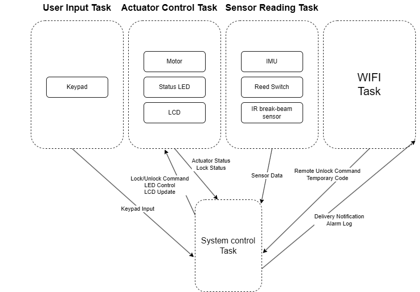
- Where did you face difficulties? This could be in firmware, hardware, software, integration, etc.
  - Hardware1: GPIO56 was originally designed for the LCD MOSI line, but we later found that it was actually configured as MISO.
  - Hardware2: GPIO26 had a pin multiplexing conflict. We intended to use it only as the pin for Keypad 3, but GSPI automatically assigned GPIO26 as the MISO pin.
  - Hardware3: Keypad C1–C4 were floating. When a logic analyzer was attached, the key press signals were stable and could be triggered reliably. However, without the logic analyzer connected, the keypad scanning became very unstable.
  - Hardware4: The IR sensor pin was originally assigned to GPIO50, but it was found to interfere with firmware flashing.
  - Hardware5: The original GPIO could not be multiplexed as a PWM output.
  - Software1: The SPI interface sometimes entered a busy state.
  - Software2: The network stack could easily get stuck during initialization.
  - Software3: During integration testing, the system could experience MQTT disconnection or even program hangs after a long period of inactivity, and the network initialization phase was also prone to getting stuck.
- How did you overcome these challenges?
  - Hardware1: We changed it to GPIO57. 
  - Hardware2: We removed the MISO multiplexing on GPIO26.
  - Hardware3: We connected ground through 18 kΩ pull-down resistors to Keypad C1–C4.
  - Hardware4: It was reassigned to GPIO8, with an external 4.7 kΩ pull-up resistor to 3.3 V.
  - Hardware5: We changed it to ULP_GPIO5.
  - Software1: This issue was addressed by switching or adjusting the configuration to use DMA.
  - Software2: To address this, we designed a reconnection mechanism and placed the network handling in a dedicated task, so that it would not block the execution of other tasks.
  - Software3: At first, we suspected a stack overflow, so we checked the remaining stack space using the high-water mark and printed it for debugging, but this did not appear to be the cause. Later, we suspected that cumulative delays over a long runtime might have caused timing issues or disorder in task scheduling.
- What would you do differently if you had to build this device again?
  We will carefully check the pin assginments and redesign the 3D model.
- What steps are needed to finish or improve this project?
  The model should be refined, especially for the hinges. For the improvement, the way to detect the input of keypad coule be more efficient. And OTA can be improved by using differential updates to increase upgrade efficiency.
- What did you learn in ESE5160 through the lectures, assignments, and this course-long prototyping project?
  I gained hands-on experience with PCB design, which I have never exposed to before. I learned bootloader, FreeRTOS, OTA and so on. Also I learned how to better work with others, how to overcome the problems I have never met before, and how to present your product to other people.
- Provide a URL to your Node-RED instance for our review (make sure it’s running on your Azure instance!)
http://4.246.123.148:1880/
- Provide the share link to your final PCBA on Altium 365.
 https://upenn-eselabs.365.altium.com/designs/AE5C7E01-FBAF-4B34-BA73-49544CBC40D7
## 3. Hardware & Software Requirements
- HRS-01: The FSR sensing subsystem shall detect an added load equivalent to ≥ 10 g placed on the mail tray as a distinguishable change at the ADC input.
    Result: We didn't use it because FSR seemed can only detect concentrated weight. The letter's area is way larger than the FSR's, so it can hardly detect the letter. 
- HRS-02: The door state sensor shall detect the door open/close with a mechanical gap of ≤ 10 mm between magnet and sensor at the "closed" position.
    Result: We tested it and the sensor met the requirment.
- HRS-03 The IMU hardware shall support 3-axis acceleration measurement with selectable full-scale range of at least ±2 g and provide either data-ready/interrupt output or continuous readout capability.
    Result: We tested it and the sensor met the requirment.
- HRS-04 The servo lock actuator shall be able to move between "locked" and  "unlocked" mechanical positions with a rotation range of ≥ 60°.
    Result: We tested it and the sensor met the requirment.
- HRS-05 The device shall include an audible or visual annunciator capable of producing ≥ 55 dBA at 10 cm (buzzer) or a clearly visible status indicator LED.
    Result: We discarded this because we thought this is unnecessary since we have email notifications.
- SRS-01 The system shall detect an insertion trigger from the IR break-beam input within 50 ms of beam interruption.
    Result: We tested it and the sensor met the requirment.
- SRS-02: Upon an IR insertion trigger, the system shall open a delivery confirmation window of 2–3 seconds during which it evaluates the FSR change to confirm delivery.
    Result: We discarded FSR as we mentioned before. The led on the cloud would turn green once the IR insertion trigger.
- SRS-03: When delivery is confirmed, the system shall publish a delivery event to the cloud within 5 seconds when Wi-Fi is available. If Wi-Fi is unavailable, the system shall defer transmission until connectivity is restored.
    Result: We tested it and the sensor met the requirment.
- SRS-04: The system shall support offline unlock using a valid locally stored keypad PIN. Upon entry of a valid PIN, the system shall actuate the servo to unlock within 2 seconds, regardless of Wi-Fi connectivity.
    Result: We tested it and the sensor met the requirment.
- SRS-05: The system shall support Remote Unlock. Upon receiving an authenticated remote command, the system shall unlock within 5 seconds when connected to Wi-Fi.
    Result: We tested it and the sensor met the requirment.
- SRS-06: The system shall implement a lockout policy. After 3 consecutive failed PIN attempts, the system shall deny further keypad unlock attempts for 30 seconds and update the failed-attempt count and lockout status for cloud publication.
    Result: We replaced this function with a email notification since it is more practical. After 3 consecutive failed PIN attempts, an email notification will be sent to user's phone, telling fail_attempts reaching 3 times.
- SRS-07 | The system shall update the local display at ≥ 2 Hz with at least: Mail Present, Lock State, Door State, Network State, and Lockout Status.
    Result: We tested it and the sensor met the requirment.
- SRS-08 | The system shall detect door open and door close state changes and publish corresponding door-state events to the cloud within 5 seconds when Wi-Fi is available.
    Result: We tested it and the sensor met the requirment.
- SRS-09 | The system shall generate and publish a lock or unlock event whenever the lock state changes, within 5 seconds when Wi-Fi is available.
    Result: We tested it and the sensor met the requirment.
- SRS-10 | The system shall detect tamper conditions and publish a tamper alert event to the cloud within 5 seconds when Wi-Fi is available.
    Result: We tested it and the sensor met the requirment.
- SRS-11 | The system shall publish periodic status updates containing at least mail presence, door state, lock state, network state, and lockout status at a configurable interval.
    Result: We tested it and the sensor met the requirment.
- SRS-12 | The system shall receive authenticated temporary pickup code updates from the cloud and store them for subsequent keypad-based unlock.
    Result: We tested it and the sensor met the requirment.
## 4. Project Photos & Screenshots
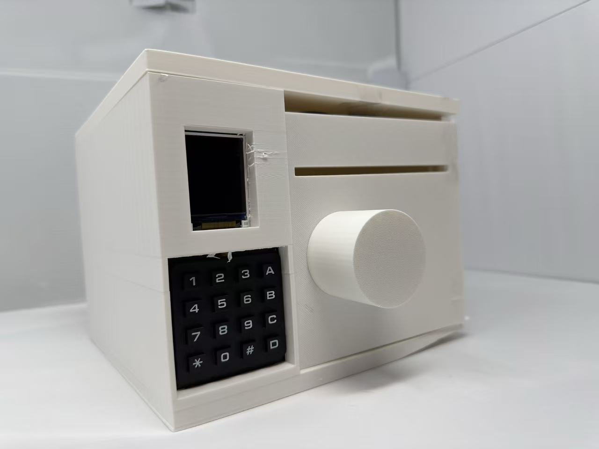
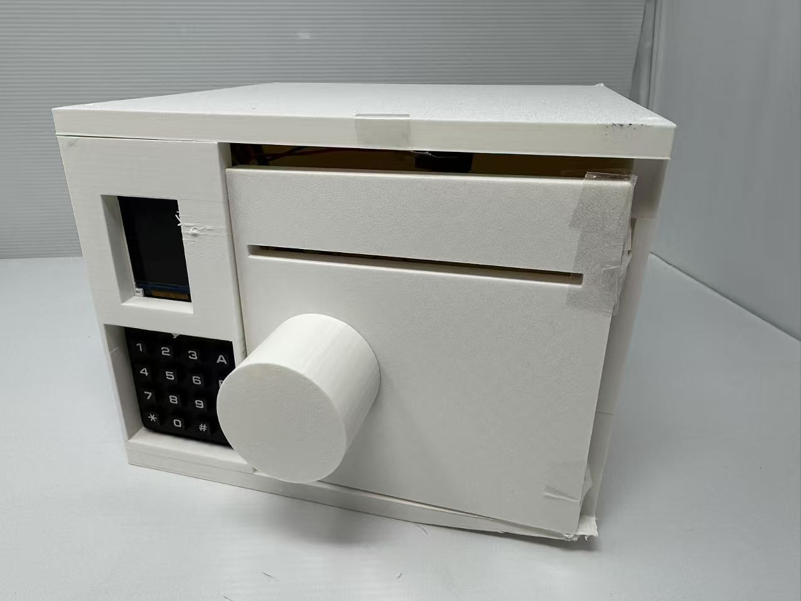
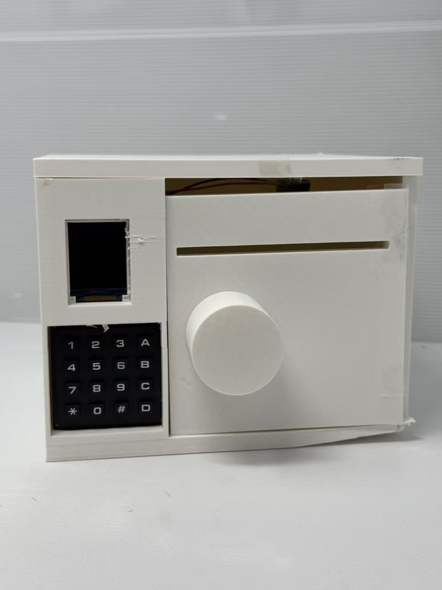
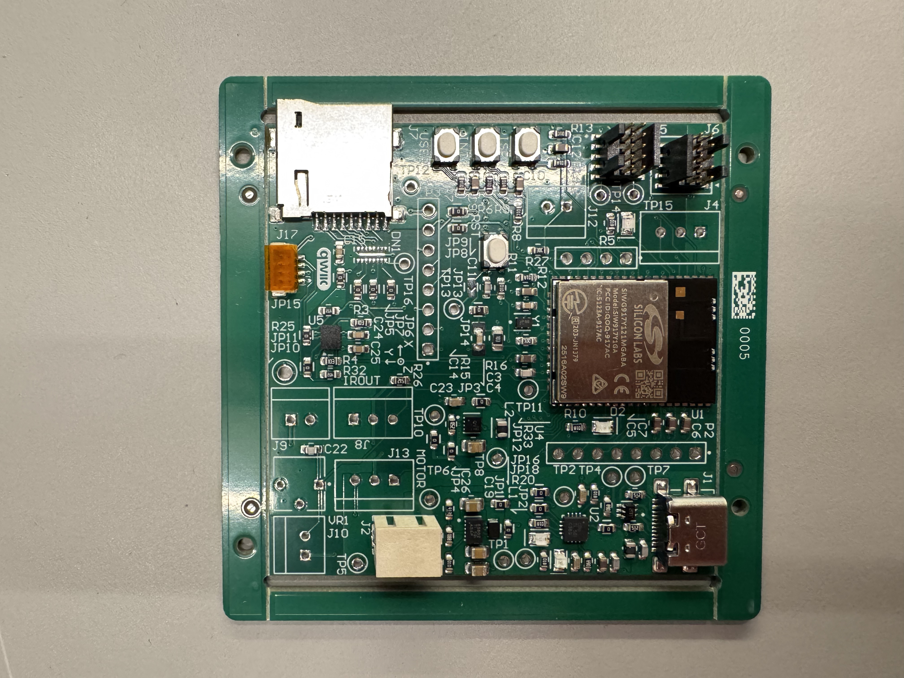
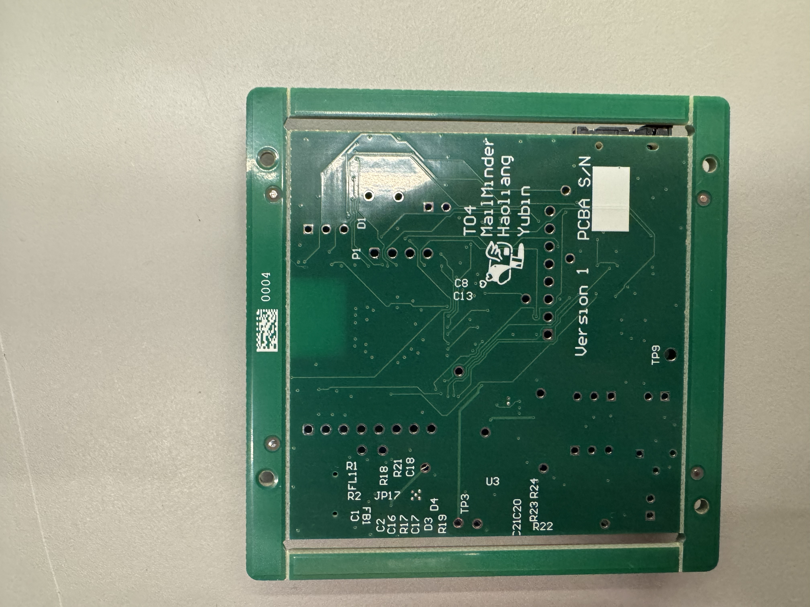
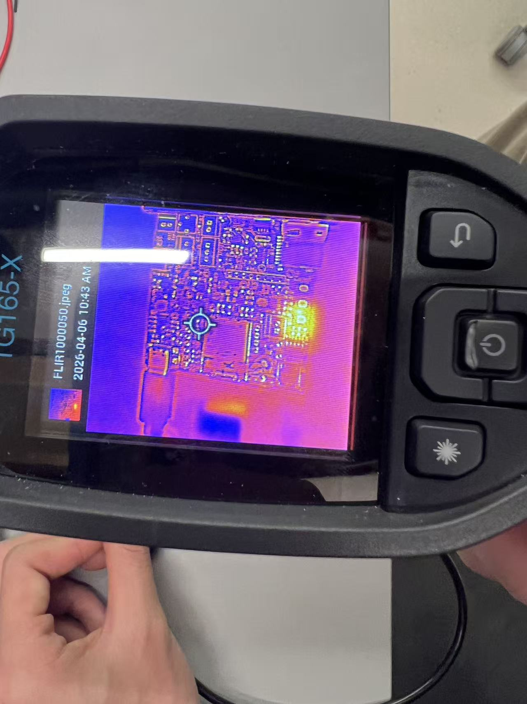
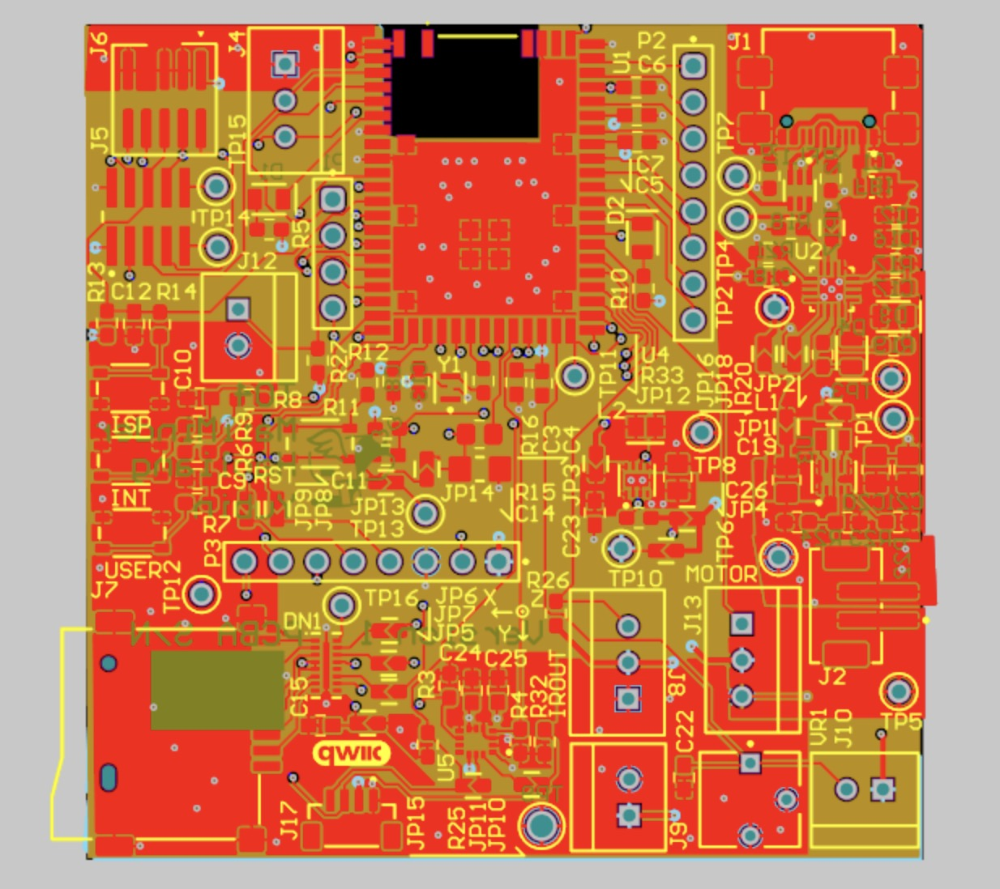
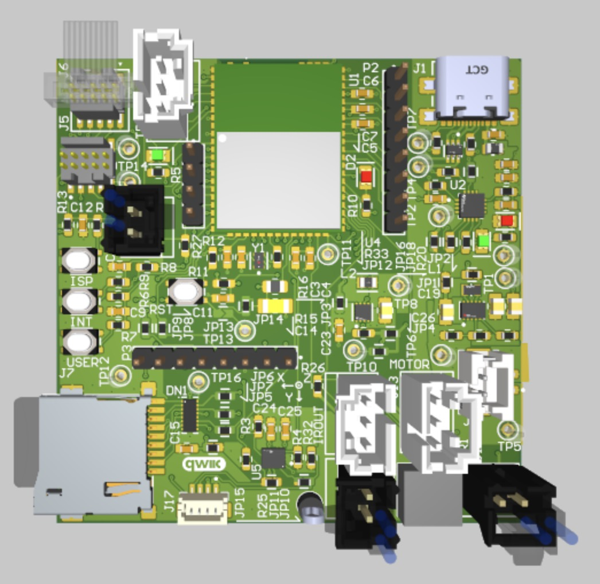
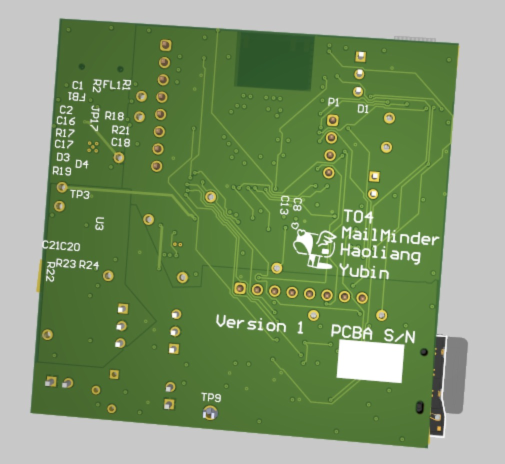
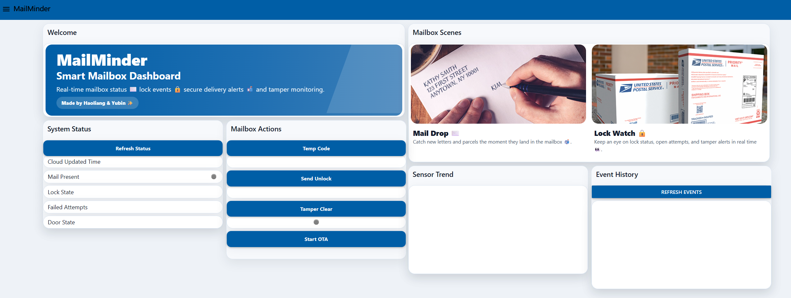
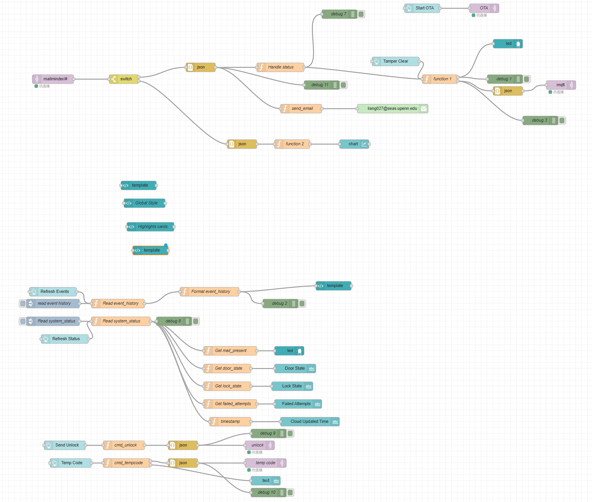

## 5. Codebase

Do *not* commit any of your source code to this repository. Rather, provide links to the other GitHub repository you've already been using with your firmware.

- A link to your final embedded C firmware codebases
  https://github.com/ese5160/final-project-firmware-s26-t04-mailminder/tree/main/0428_sl_final/app/core
- A link to your Node-RED dashboard code
  http://4.246.123.148:1880/#flow/e9cfaa8ead530e0d
- Links to any other software required for the functionality of your device